# Web:Bit 陣列

陣列可以將數字、文字、列表或變數，按照順序組合起來，這些按序排列資料集合就稱作陣列，一個陣列可以再細分為多個元素，或是一個陣列內還包含其他陣列，在進行比較複雜的運算時，也會透過陣列的操作來實現。

## 陣列積木清單

陣列積木包含建立陣列、建立空陣列、使用文字建立陣列、陣列取值、陣列編輯...等常用功能。

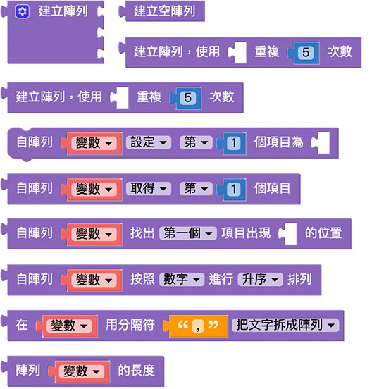

## 空陣列{{array01}}

「空陣列」積木會建立一個陣列容器，也就是裡面沒有包含任何元素的陣列

如果要用變數進行陣列的操作，首先必須把這個變數定義為陣列或空陣列，才能針對這個變數進行陣列數值的添加、刪除、編輯...等動作。

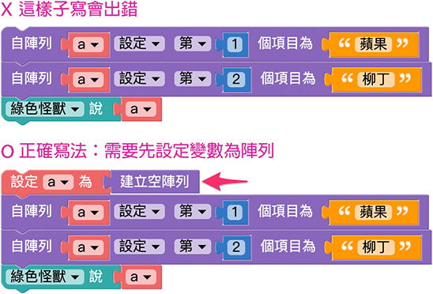

## 建立陣列{{array02}}

「建立陣列」積木可以透過指定位置放入對應的內容，建立一個帶有數值的陣列。

點擊藍色小齒輪，可以增加放入內容的缺口。

建立陣列完成後，可以透過小怪獸講出陣列 ( 陣列內容會用逗號分隔 )。

或是也可以透過重複迴圈，依序講出陣列內容。

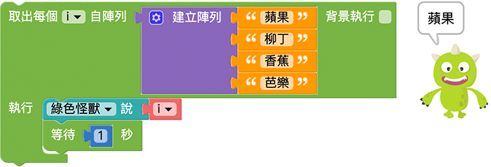

## 建立重複內容陣列{{array03}}

「建立重複內容陣列」積木可以建立具有重複數值重複的列表，數值可以變數、文字、數字或陣列陣列，將熟放入缺口內，就會根據重複設定的次數建立陣列。

舉例來說讓「芭樂」文字重複五次並建立陣列，綠色小怪獸就會唸出五個芭樂的文字。

## 設定陣列內容{{array04}}

「設定陣列內容」積木可以針對陣列的內容 ( 第幾個、倒數第幾個、第一個、最後一個和隨機 ) 進行三種編輯行為 ( 設定、插入或移除 )。

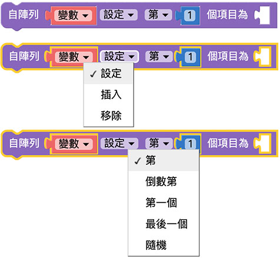

舉例來說，原本的陣列有四種水果蘋果、柳丁、香蕉和芭樂，透過「設定陣列內容」積木將陣列中第一個水果元素換成蓮霧，綠色小怪獸講出的陣列第一個元素就變成了蓮霧，接著隨機移除陣列的一個內容，紅色小怪獸講出的陣列就會變成只有三種水果。

如果接著使用「插入」桃子元素在「最後一個項目」，就可以看到陣列又變成四種水果，最後一種是桃子。

## 取得陣列內容{{array05}}

「取得陣列內容」積木可以取得一個陣列中某個元素的值 ( 第幾個、倒數第幾個、第一個、最後一個和隨機 )，或是取得某個元素的值之後，同時移除該元素 。

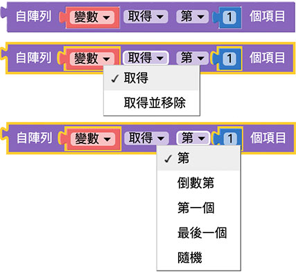

如果單純取得某個元素的值，並不會影響原本陣列的內容和長度，但如果是「取得後移除」，這個陣列就不再包含這個元素，例如一開始有四種水果，如果只是取得內容，取得內容後的陣列依然是四種水果，不過如果取得後移除內容，取得內容之後陣列就變成了只有三種水果。

## 尋找陣列內容{{array06}}

「取得陣列內容」積木能從一個陣列中，找到特定元素所在的位置，並回傳該位置的號碼。

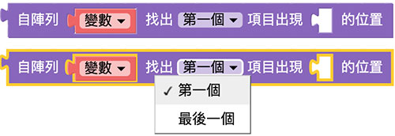

透過取得陣列積木來取得水果陣列，就能知道蘋果位在第一個位置、柳丁位在第二個位置、香蕉位在第三個位置、芭樂位在第四個位置。

> 注意，如果是「寫程式碼」而非使用「積木」，第一個位置通常都是 0，第二個位置是 1，因為和生活習慣一至，在程式積木裡頭第一個位置的顯示為 1，第二個位置為 2，依此類推。

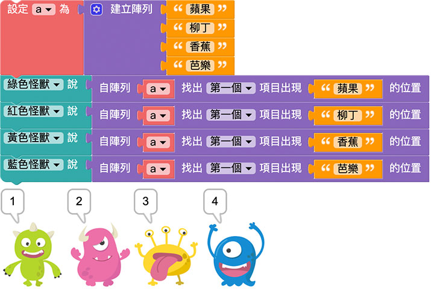

## 陣列排序{{array07}}

「陣列排序」積木會將指定的陣列做字母、數字的排序，排序後會形成一個新的陣列，*不會影響原本陣列的排序*。

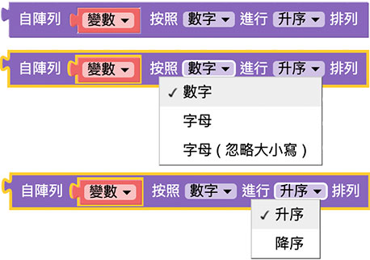

從下圖的例子可以看出，綠色小怪獸會講出按照字母排序過後的水果陣列 ( a,b,c,.... )，而紅色小怪獸講出原本的水果陣列並沒有受到排序積木的影響。

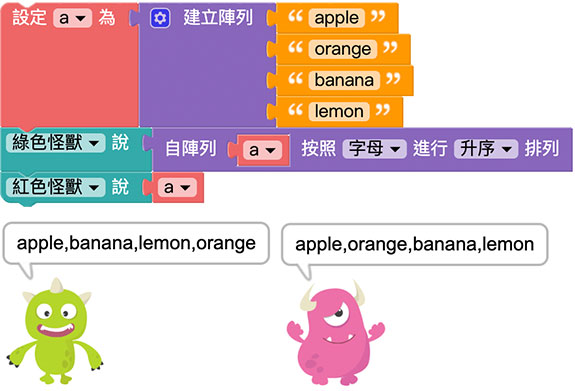

如果選擇字母排序，就會「*先按照字母大小寫排序，大寫在前，小寫在後，排序後再按照第二個字母排序*」，如果選擇不區分大小寫，就會直接進行排序，「*如果第一個字母相同，就用第二個字母排序*」，以下圖的例子，大寫 A 在前小寫 a 在後，排序後再按照 123、456 進行排序。

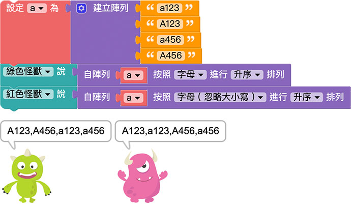

## 文字與陣列轉換{{array08}}

「文字與陣列轉換」積木可以將帶有「分隔符」( 類似空白、逗號、分號...等分隔符號 ) 的文字轉換為陣列，或是將陣列合併為一串文字。

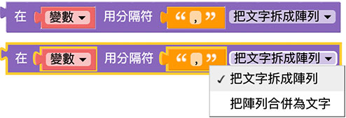

如果一串文字沒有變成陣列，其中第二個元素就會是第二個字 ( 綠色小怪獸就會講出「果」 )，如果將文字拆分為陣列，第二個元素就會是陣列中的第二個內容 ( 紅色小怪獸就會講出「柳丁」 )。

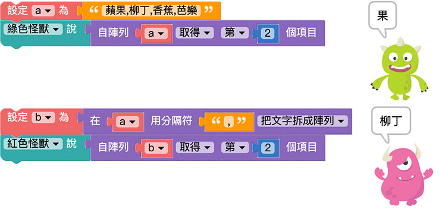

反之如果是將陣列合併為文字，可以將分隔符留空，就會看見陣列的內容變成一整串的文字，中間不會有逗號分隔，如果帶有分隔符 ( 例如 a )，就會看見結合成的文字中間都有 a。

## 陣列長度{{array09}}

「陣列長度」積木可以取得個陣列的元素總數，如果是空陣列則陣列長度為 0。

因為陣列長度表示的是「陣列的空格數」( 陣列可以放入多少個元素 )，所以如果「有空格」但沒有放入元素，仍然會影響陣列長度，例如有個四格空格的陣列，但只放入了三種水果，最後呈現出來的陣列長度就是 4。

