# Web:Bit 文字

文字積木除了可以顯示有意義的詞彙，也可以透過相加的方式把文字組合，或是在一段詞彙中尋找對應的字詞或字母，甚至也可顯示語音辨識的內容或物聯網串感器的狀態。

## 文字積木清單

文字積木分別有指定文字、換行、轉換大小寫、建立字串、文字工具、文字查找、文字取代、文字轉換...等常用的文字功能。

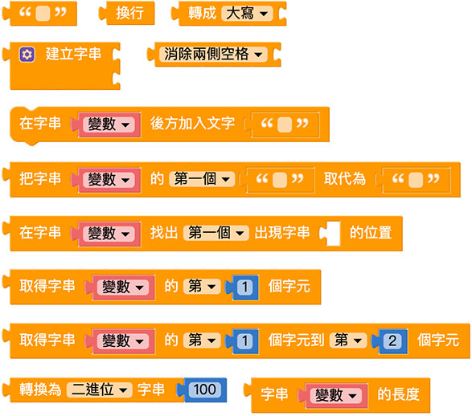

## 指定文字{{text01}}

「指定文字」積木可以輸入指定的文字，以便其他積木使用。

例如在小怪獸講話積木後方接上指定文字，輸入 hello，執行後小怪獸就會說出 hello。

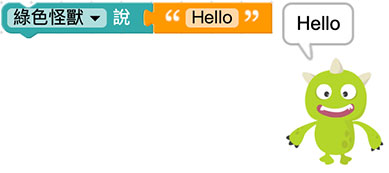

## 換行{{text02}}

「換行」積木可以將一段文字從指定的位置折行。

## 建立字串{{text12}}

「建立字串」積木可以把不同的文字積木組合成一段文字。

點擊藍色小齒輪，透過拖拉組合可以增加文字缺口。

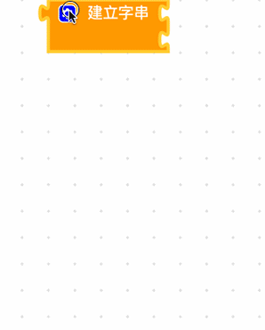

在文字缺口內放入指定的文字積木或是換行積木，就可以認字組合出欲顯示的文字，從下圖可以看到組合過的文字和單行文字的差異。

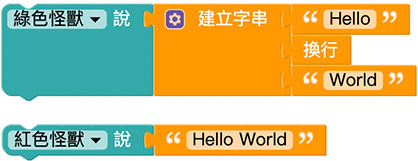

建立字串也可以用來組合兩個變數，例如變數 a 為 hello，變數 b 為 world，透過建立字串就能將兩個變數組合為中間換行的 hello world。

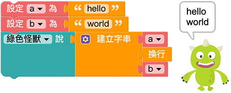

## 在變數後方加入文字{{text03}}

「在變數後加入文字」能夠改變原本變數的內容，使原本變數的內容後方額外增加文字。

因為是以「變數」為主，所以如果要讓小怪獸講話，就變成是使用變數的方式呈現。

## 取代文字{{text04}}

「取代文字」積木可以快速將一段文字裡的某些字，替換為其他的文字，下拉選單可以選擇要更換第一個指定的文字，或所有指定的文字。( 取代文字不會對變數進行變更，而是產生一段全新的文字 )

下圖的例子可以只更換第一個「蘋果」變成「楊桃」，或是更換所有的「蘋果」為「楊桃」。

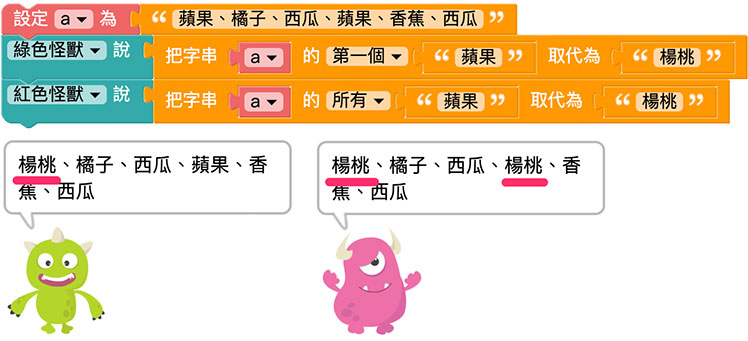

## 尋找字串出現位置{{text05}}

「尋找字串出現位置」會回傳指定文字在一段文字中出現的位置，可以選擇第一個出現的位置或最後一個出現的位置。

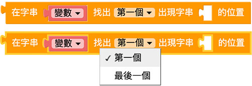

文字出現的位置是以「字數」來判斷，以下圖的例子，橘子的「橘」位在整段文字的第 4 個位置，所以出現的數字為 4，蘋果的蘋出現在第 10 個位置，如果換成英文，orange 的 o 位在第 10 個位置，banana 的 b 位在第 16 個位置。

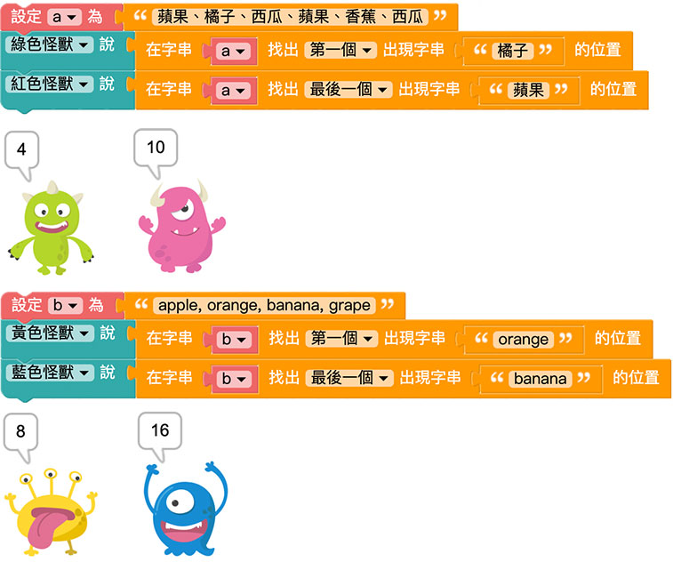

## 取得指定位置的文字{{text06}}

「取得指定位置的文字」積木會取出指定位置的文字，下拉選單共有五種指定位置，分別是第幾個、倒數第幾個、第一個、最後一個和隨機位置。

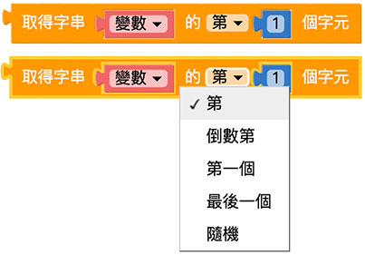

以下圖的例子，第 4 個字是橘，第 11 個字是果。

## 取得指定區間的文字{{text07}}

「取得指定區間的文字」積木會取出一段指定區間內的文字，需注意的是*第一個空格的數字要比第二個空格內的數字小*。

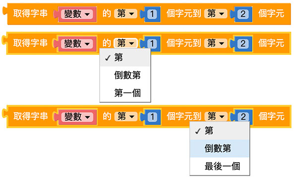

以下圖的例子，第 3~8 的文字為「、橘子、西瓜」，而第 8 到最後的文字為「瓜、蘋果、香蕉、西瓜」。

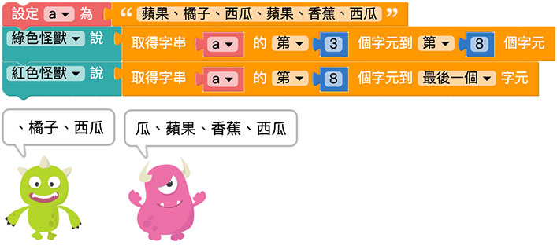

## 轉換大小寫{{text08}}

「轉換大小寫」積木可以針對「英文字」進行大小寫轉換，包含全部轉大寫、全部轉小寫或是首字母大寫。

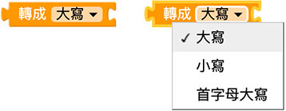

以下圖的例子，可以全部轉換為大寫，或是只有第一個 A 是大寫。

## 消除空格{{text09}}

「消除空格」積木可以消除一段文字中左邊、右邊或左右兩邊的空白字元。

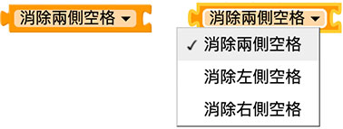 

## 進位轉換{{text10}}

「進位轉換」積木能把數字轉換為二進位、八進位、十進位或十六進位的文字。

 

例如數字 200 轉換為二進位就是 11001000，轉換為八進位就是 310，轉換為十六進位就是 c8。

 

## 文字長度{{text11}}

「文字長度」積木可以取得一串文字的總字數，比較需要注意的是英文字以「字母」為單位，且空白也算是一個字元。

 

以下圖為例，「一個蘋果」的文字長度為 4，「An apple」因為包含空格，所以文字長度為 8。

 

