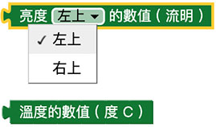
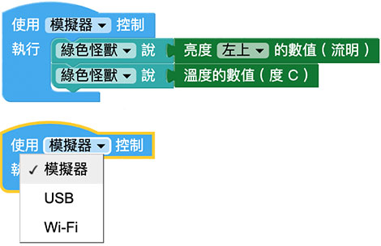
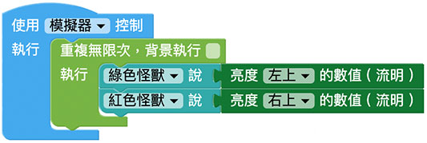
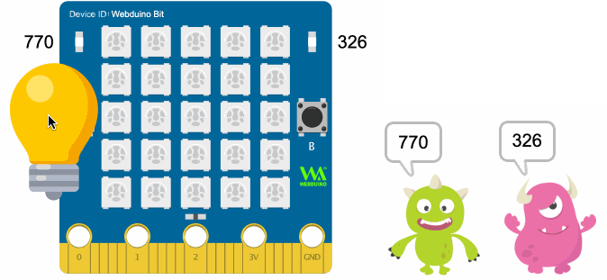
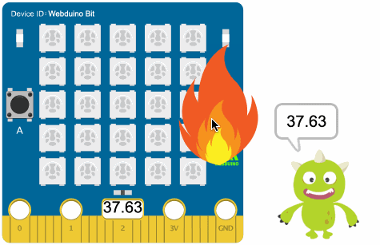

# Web:Bit 偵測光線＆溫度

Web:Bit 開發板內建兩個光敏電阻，以及一個溫敏電阻，光敏電阻可以偵測環境光線的流明數值，溫敏電阻則可偵測到小數點兩位的溫度變化，藉由光線和溫度的偵測，就能輕鬆地做出環境監控相關的場域應用。

## 積木清單

偵測光線分別可以偵測左上和右上的亮度變化，偵測的單位為流明，數值區間為 0~1000 的整數，溫度偵測的單位為度 C，數值可到小數點兩位。

> *偵測光線和溫度積木必須搭配「開發板」積木*，選擇模擬器，執行後可以使用滑鼠拖拉模擬器的燈泡或火焰，選擇 USB，執行後會透過 USB 連線方式控制實體開發板，選擇 Wi-Fi 則可透過 Wi-Fi 指定 Device ID 操控。
> - USB 控制模式為「安裝版編輯器」限定，請參考 [Web:Bit 編輯器](../index.html#software)
> - Wi-Fi 模式需要開發板連接 Wi-Fi，請參考 [Web:Bit 硬體開發板 ( 初始化設定 )](../info/setup.html)

## 偵測光線{{pt01}}

「偵測光線」積木使用時只會偵測一次，搭配重複迴圈就能進行連續偵測。

執行後，如果是使用模擬器，*畫面裡會出現「一個燈泡」圖案*，拉動燈泡靠近畫面裡的光敏電阻，就能模擬光線的變化，如果是使用實體開發板，可用光線照射光敏電阻觀察光線變化。

了解光線偵測原理後，若搭配簡單的邏輯判斷，就能做出小夜燈的效果，以下圖的例子而言，只要左邊或右邊的任何一個光敏電阻偵測到亮度大於等於 600 流明，就會熄燈，反之左右兩邊只要同時偵測的數值小於 600 流明就會亮白燈。

## 偵測溫度{{pt02}}

「偵測溫度」積木使用時只會偵測一次，搭配重複迴圈就能進行連續偵測。

執行後，如果是使用模擬器，*畫面裡會出現「一個火焰」圖案*，拉動燈泡靠近畫面裡的熱敏電阻，就能模擬溫度的變化，如果是使用實體開發板，可用手指按壓熱敏電阻、或用嘴對著熱敏電阻吹氣，就能觀察溫度變化。

了解溫度偵測原理後，若搭配簡單的邏輯判斷，就能做出用顏色反映溫度的效果，當溫度大於等於 50 度就呈現紅色，反之小於 40 度就是藍色。

