# Web:Bit Google 試算表

透過 Web:Bit 編輯器的 Google 試算表功能，只需要簡單幾個步驟，就能將 Google 試算表當作資料庫，儲存傳感器所接收到的訊號數值，或透過開發板顯示試算表讀取的資料。

## 建立並設定試算表權限

使用 Web:Bit 編輯器操作 Google 試算表之前，*必須先建立試算表，並設定試算表的權限*，所以請先用 Google 帳號登入 Google 雲端硬碟，在雲端硬碟裡建立一份全新的空白試算表。

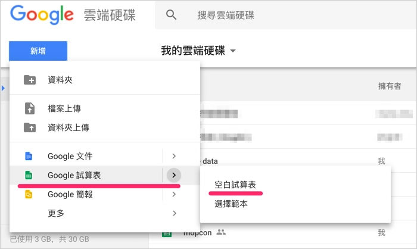

開啟試算表後，在左上方輸入試算表名稱，就能完成建立 Google 試算表的動作，*「試算表」表示整份試算表，每份試算表內可以包含許多「工作表」*，兩者可分別給予不同名稱。

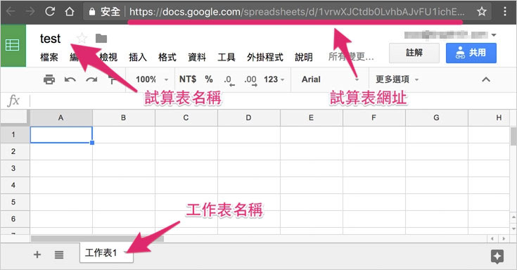

點選試算表右上角的「共用」，設定試算表的權限。

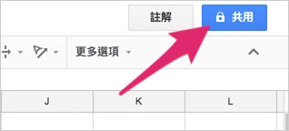

開啟共用設定視窗，點選「進階」。

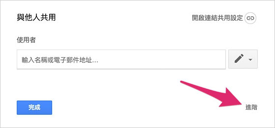

每份新建立的試算表權限都是「私人 - 只有您能存取」，點選後方的「變更」就可進行設定。

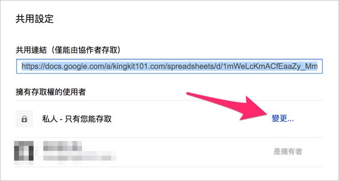

將試算表的權限，設定為*「任何知道連結的使用者」，都可以「編輯」*，按下儲存，試算表的權限就設定完成。

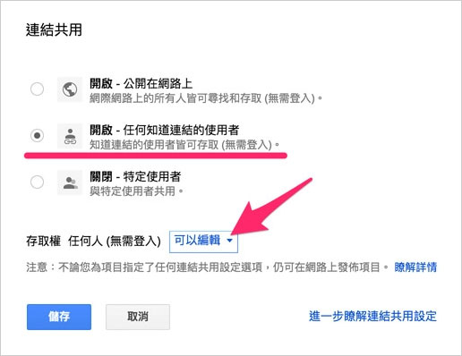

## Google 試算表積木清單

Google 試算表積木包含試算表初始化、讀取資料、寫入資料、刪除列或欄、增加列或欄...等功能。

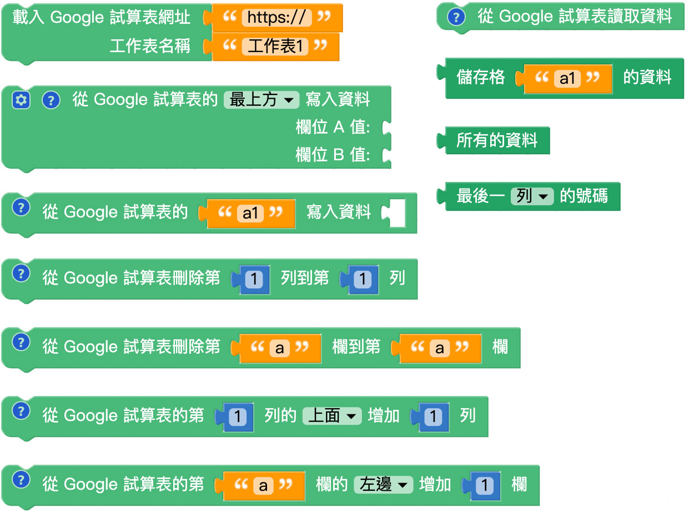

## 試算表初始化{{gs01}}

「試算表初始化」積木可以設定試算表的網址和工作表名稱，在操作試算表的任何功能之前，都需要先使用試算表初始化的積木。

> 注意，請勿將「試算表」名稱填入「工作表」名稱的位置。

## 寫入資料{{gs02}}

「寫入資料」積木能夠將資料寫入試算表，並能指定從上方第一列寫入或將資料放在最後一列。

> 寫入資料積木屬於「*寫入資料後才會繼續執行後方程式*」的類型，當編輯畫面中有這塊積木，*執行時當程式遇到這塊積木會暫停，直到資料寫入後才會再繼續*。

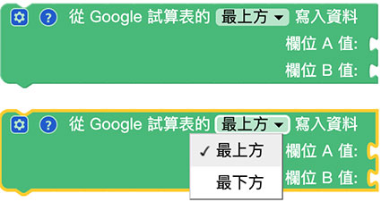

點選積木前方的藍色小齒輪，可以增加寫入資料的欄位數量。

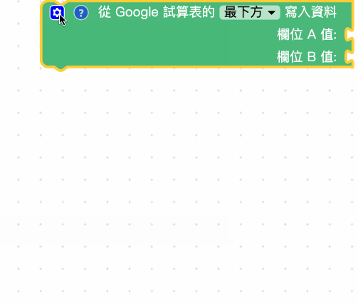

先使用初始化試算表積木，填入自己的試算表網址，再放上寫入資料的積木，執行後就會看見試算表內出現時間和文字。

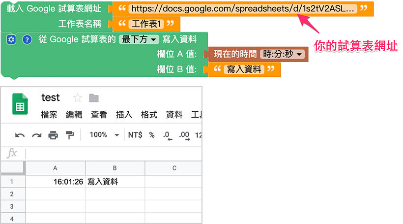

搭配重複迴圈，就能不斷寫入資料到試算表內。

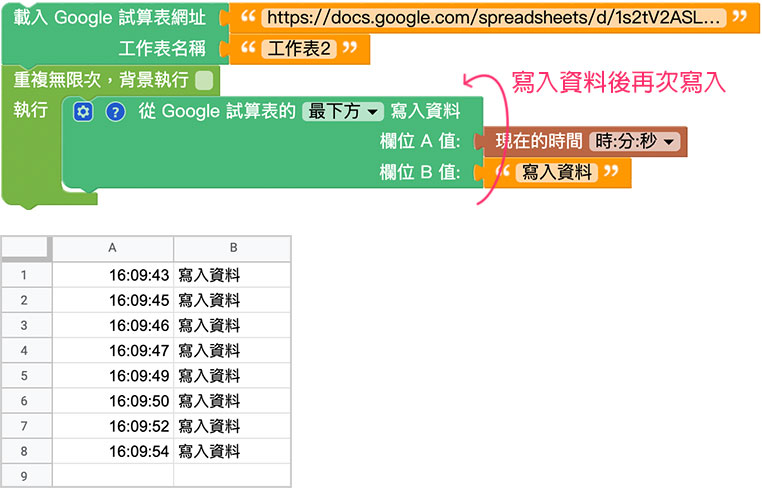

## 指定儲存格寫入資料{{gs03}}

「指定儲存格寫入資料」可以將資料寫入指定的儲存格，格式除了單一數值，也支援二維陣列格式的資料。

> 指定儲存格寫入資料積木屬於「*寫入資料後才會繼續執行後方程式*」的類型，當編輯畫面中有這塊積木，*執行時當程式遇到這塊積木會暫停，直到資料寫入後才會再繼續*。

以下圖的例子，執行後會在 b2 儲存格，寫入「寫入資料」四個字。

除了可以指定單一儲存格，這塊積木也*支援「範圍」儲存格和「二維陣列」的資料格式*，例如要將資料寫入 `a1:b3` 的儲存格範圍，就需要使用 `[[a,b],[c,d],[e,f]]` 二維陣列資料，*二維陣列的第一層為縱列 ( 1、2、3... )，第二層為橫欄 ( A、B、C... )*。

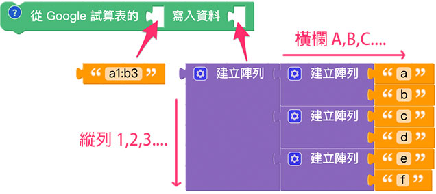

以下圖的例子，執行後會在 A1 寫入 a，B1 寫入 b，A2 寫入 c，B2 寫入 d...依此類推。

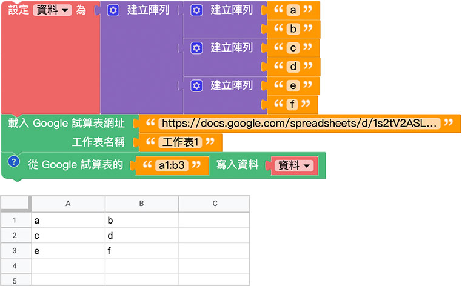

## 讀取資料{{gs04}}

「讀取資料」積木可以讀取單一儲存格、整份工作表或最後一列、最後一欄的號碼。

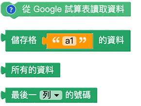

「讀取資料」積木屬於「*讀取完成才會繼續執行後方程式*」的類型 ( 點擊前方問號小圖示會提示 )，當編輯畫面中有這塊積木，*執行時當程式遇到這塊積木會暫停，直到取得資料後才會再繼續*。

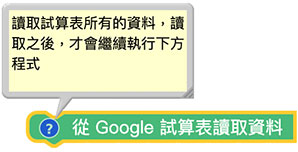

首先準備一份有資料的試算表，下圖範例使用復仇者聯盟的成員稱號和姓名。

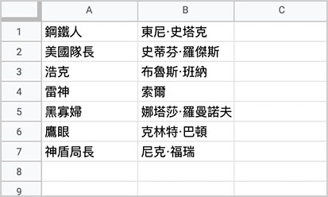

若使用「讀取單一儲存格」的積木，就能在讀取到資料後，讓小怪獸分別講出對應儲存格的內容。

若需要讀取的資料量比較多，建議使用「讀取所有資料」的積木，該積木讀取到的資料，*會以「二維陣列」的方式呈現*，故而可以使用陣列積木進行操作，以下方的例子，搭配重複迴圈，就能在讀取資料後，讓小怪獸依序念出復仇者聯盟成員的稱號和姓名。

> 取得資料的二維陣列的*第一層為縱列 ( 1、2、3... )，第二層為橫欄 ( A、B、C... )*。

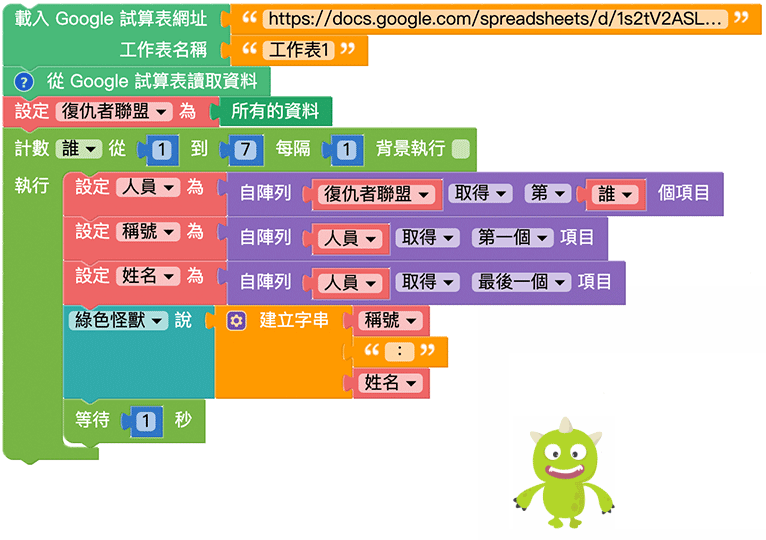

取得的資料除了資料內容，也包含了資料所在的最後一列和最後一欄，可以透過相關積木取得對應的編號 ( 橫向欄位使用數字表現，a 對應 1，b 對應 2，依此類推 )，以復仇者聯盟成員試算表的內容為例，取得的最後一列為 7，最後一欄為 2。

## 刪除列或欄{{gs05}}

「刪除列或欄」積木可以刪除一個區間的列或欄，列號以數字表現，欄號使用英文表示。

> 刪除列或欄的積木屬於「*刪除後才會繼續執行後方程式*」的類型，當編輯畫面中有這塊積木，*執行時當程式遇到這塊積木會暫停，直到刪除了列或欄之後才會再繼續*。

## 增加列或欄{{gs06}}

「增加列或欄」積木可以增加一個區間的列或欄，列可以選擇增加在上方或下方，欄可以選擇增加在左方還是右方。

> 增加列或欄的積木屬於「*增加後才會繼續執行後方程式*」的類型，當編輯畫面中有這塊積木，*執行時當程式遇到這塊積木會暫停，直到增加了列或欄之後才會再繼續*。

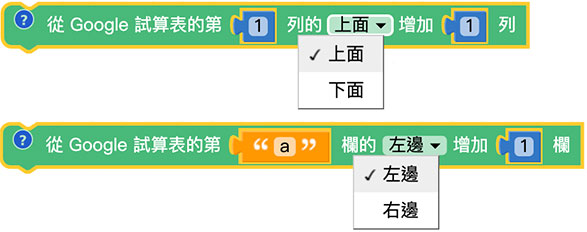

