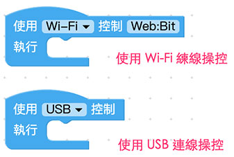
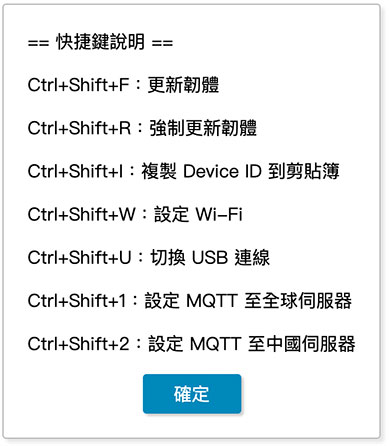

# Web:Bit 編輯器 ( 安裝版工具列 )

Web:Bit 編輯器的安裝版是特別為了沒有 Wi-Fi 的環境所打造，只要將編輯器打開，將 Web:Bit 開發板連接 USB 線就可以進行操控、更新或相關設定，這篇教學會介紹安裝版的工具列功能。( 以下將編輯器安裝版統稱為安裝版 )

> 安裝版下載：[WebBitSetup.exe](https://ota.webduino.io/WebBitInstaller/WebBitSetup.exe#_blank)

## 功能說明

安裝版的工具列裡分別有「*系統*」、「*工具*」和「*資訊*」三個主要功能列表。

### 系統 > 以瀏覽器開啟

點選「以瀏覽器開啟」，會自動開啟電腦的 Chrome 瀏覽器並連結至 [Web:Bit 編輯器 ( 網頁版 )](https://webbit.webduino.io#_blank)，通常這個功能不太常用到，但如果使用安裝版不支援的功能 ( 像是「語音朗讀」在安裝版僅能發出英文語音 )，可以透過網頁版來實現。

### 工具 > 關閉 USB 連線

如果 Web:Bit 開發板使用 USB 線連接到電腦，安裝版可以在沒有 Wi-Fi 的狀態下控制開發板，但此時開發板也「沒有 Wi-Fi 連線功能」，如果要開啟開發板的 Wi-Fi 連線功能，則需關閉安裝版程式，或是點擊「關閉 USB 連線」功能。

> 注意，*如果關閉 USB 連線，開發板就會採用 Wi-Fi 連線模式，反之開啟 USB 連線，開發板就會關閉 Wi-Fi 連線功能*。

在操作上也可以透過下拉選單區隔 Wi-Fi 操控或 USB 連線操控。( 詳細操作方式會在後面的篇幅介紹 )

### 工具 > 設定 Web:Bit WiFi

點擊該選項之後，會要求我們輸入 Wi-Fi 的 SSID 和密碼，這功能可以幫助我們將「欲連線的基地台」的 Wi-Fi SSID 和密碼設定到 Web:Bit 開發板中，不過如果沒有 Wi-Fi 操控的需求，是不會用到該功能的。( 詳細設定可以參考 [初始化方法 1：使用安裝版進行初始化](setup.html#step1) )

### 工具 > 更新韌體

如果 Web:Bit 開發板有新版本的韌體，可以點擊該選項進行韌體更新。( 詳細設定可以參考 [更新韌體方法 1：使用安裝版進行更新](setup.html#step1) )

### 工具 > 強制更新韌體

如果 Web:Bit 開發板的韌體有問題而無法讀取 ( 程式錯誤或自行寫入其他韌體 )，可以用滑鼠選擇「*工具 > 回復原廠韌體*」進行韌體更新。( *強制更新韌體可能會讓 Device ID 不同*，請特別注意！ )

### 工具 > 設定 MQTT 伺服器

因應中國伺服器架構不同，如果是簡體中文版本，請將 MQTT 伺服器設定為「中國」，繁體中文和英文版本預設為「全球」。

### 資訊 > 版本、複製裝置 ID、快捷鍵說明

版本功能會顯示目前 Web:Bit 的韌體版本，複製裝置 ID 可以將 Web:Bit 開發板的 Device ID 複製到剪貼簿，而快捷鍵會顯示安裝版支援的各種快捷鍵。

